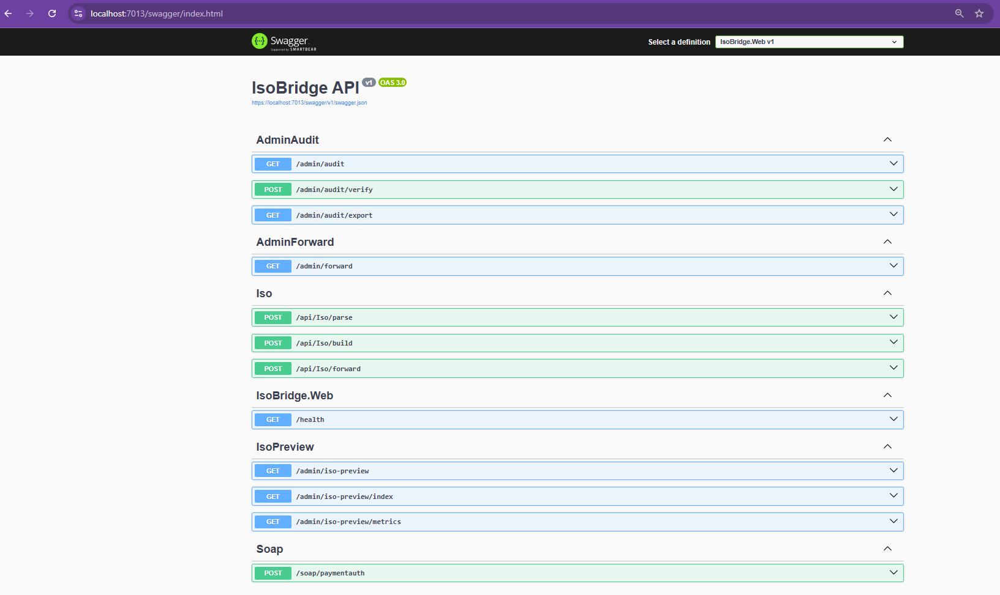
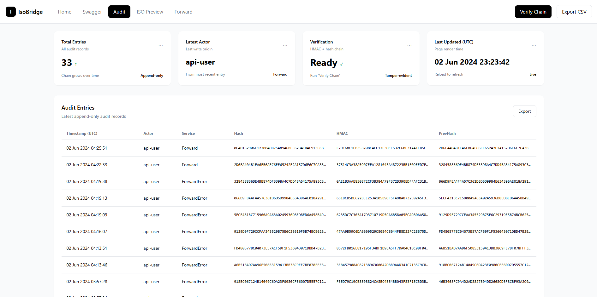
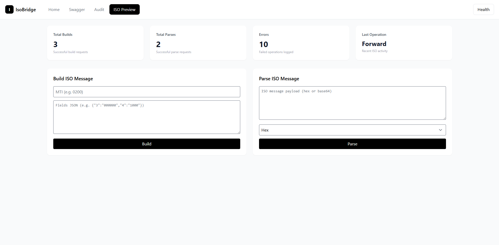
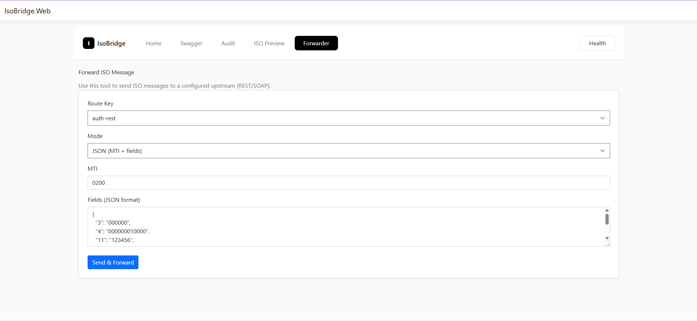
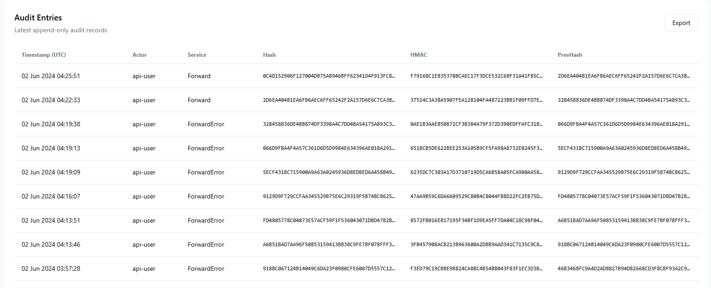

# IsoBridge [](LICENSE)

> **Bridging legacy financial switches with modern systems — transparently, audibly, and for free.**

---

## 🌍 About the Project

**IsoBridge** is a complete, working ISO 8583 parser, builder, and forwarder built in **.NET 6**.  
It was created to solve a gap in financial technology that very few engineers understand, the **grey area** of ISO 8583 message processing, POS switching, and banking integrations.

When I began working on ISO 8583 systems, I realized how much time engineers wasted trying to decode these old formats, how hard it was to test message parsing, and how little open-source tooling existed, especially in African fintech.  
This project is my contribution to close that gap.

IsoBridge is **not a library demo**. It’s a **real, functional bridge** that:
- Parses ISO 8583 messages (binary, hex, or ASCII),
- Builds ISO messages from JSON inputs,
- Forwards them to external systems (REST or SOAP),
- And **logs every transaction with full audibility**.

I’m not maintaining it further.  
Please **don’t open issues or PRs** — just ⭐ the repo if you find it useful.  
You’re free to use, modify, and extend it for your own projects — it’s 100% **MIT licensed**.

---

## 🧩 Architecture Overview

IsoBridge follows a modular, layered architecture for clarity and testability.

| Layer | Project | Description |
|-------|----------|-------------|
| **Web/API Layer** | `IsoBridge.Web` | ASP.NET Core MVC + Minimal API hosting layer. Exposes `/api/iso/*` endpoints and the Swagger UI. |
| **Core** | `IsoBridge.Core` | Defines domain models (`IsoMessage`, `ParseResult`, etc.) and interfaces like `IIsoParser`. |
| **ISO8583 Engine** | `IsoBridge.ISO8583` | Implements ISO 8583 parsing/building logic, bitmap utilities, codecs, and template loading. |
| **Infrastructure** | `IsoBridge.Infrastructure` | Provides data persistence, audit logging, hashing, and verification (using EF Core + SQLite). |
| **Adapters** | `IsoBridge.Adapters` | Handles message forwarding to external endpoints (REST, SOAP). |
| **Tests** | `IsoBridge.Tests` | Automated unit and integration tests with xUnit. |

---

## 🧠 System Flow

1. A user or external service calls one of the API endpoints (`/api/iso/parse`, `/api/iso/build`, or `/api/iso/forward`).
2. The **Web layer** routes the request to the correct controller or minimal API.
3. The **Core parser** converts between raw ISO bytes and structured JSON fields.
4. The **Infrastructure** layer logs the request and response with an auditable hash chain.
5. Optionally, the **Adapters** layer forwards the built ISO message to an upstream host.
6. The **Admin UI** and Swagger allow live testing and message inspection.

---

## 💻 How to Run IsoBridge

### **1️⃣ Prerequisites**

- [.NET 6 SDK](https://dotnet.microsoft.com/en-us/download/dotnet/6.0)
- [Docker Desktop](https://www.docker.com/products/docker-desktop/) (optional)
- Git

---

### **2️⃣ Run via .NET CLI**

```bash
git clone https://github.com/yourusername/IsoBridge.git
cd IsoBridge/IsoBridge.Web
dotnet run

Then open your browser at:  
👉 [http://localhost:5000/swagger](http://localhost:5000/swagger)

---

### **3️⃣ Run via Docker**

If you want to build and run it containerized:

```bash
docker compose build --no-cache
docker compose up
```

Once it’s running:  
👉 [http://localhost:8080/swagger](http://localhost:8080/swagger)

---

### **4️⃣ Database**

A lightweight **SQLite** file (`audit.db`) will be created automatically in your working directory.  
This stores audit logs for every parsed, built, or forwarded message.

---

## 🖥️ User Interfaces

### 🧭 **Swagger UI**

The easiest way to explore the system.  
You can call:

- `POST /api/iso/parse`
- `POST /api/iso/build`
- `POST /api/iso/forward`

📸 **Screenshot:**



---

### 🧮 **Admin Dashboard**

A simple TailwindCSS-based UI that lets you:
- Paste ISO hex strings and see the parsed fields.
- Rebuild or verify messages visually.
- Inspect recent audit entries.

📸 **Screenshot:**




---

### 🔍 **ISO Preview**

The **ISO Preview** page provides a developer-friendly interface for visualizing and debugging ISO 8583 messages.  
It’s built with **TailwindCSS** and lets you:

- Paste raw ISO hex strings.  
- Instantly view parsed MTI and field values.  
- Verify bitmap correctness.  
- Compare multiple parsed messages side-by-side.  

This is especially useful when debugging POS or switch traffic from logs.

📸 **Screenshot:**




---

### 🚀 **Forward Simulator**

The **Forward** feature acts as a smart ISO proxy — it takes a built ISO message and forwards it to a configured route (REST or SOAP).

Key features:
- Supports **routeKey-based routing** via configuration (`appsettings.json` → `Forwarding:Routes`).
- Supports **REST and SOAP** endpoints.  
- Displays real-time forwarding results and response payloads.  
- Allows developers to replay messages directly from the UI or Swagger.

This mimics a **mini switching layer** and helps fintech teams test integration with upstream hosts.

📸 **Screenshot:**




---

## ⚙️ Code Examples

### 1️⃣ Parse an ISO Message (HTTP)

```bash
curl -X POST http://localhost:5000/api/iso/parse \
  -H "Content-Type: application/json" \
  -d '{"mode":"hex","encoding":"hex","payload":"30313030F23C449108E180000000000000000016303030303030303031323334353637383930"}'
```

✅ **Response:**

```json
{
  "mti": "0100",
  "fields": {
    "2": "4111111111111111",
    "4": "000000001000",
    "41": "TERM001",
    "49": "840"
  }
}
```

---

### 2️⃣ Build an ISO Message (HTTP)

```bash
curl -X POST http://localhost:5000/api/iso/build \
  -H "Content-Type: application/json" \
  -d '{"mti":"0100","fields":{"2":"4111111111111111","4":"000000001000","41":"TERM001","49":"840"}}'
```

✅ **Response:**

```json
{ "hex": "30313030F23C..." }
```

---

### 3️⃣ Forward a Message (HTTP)

```bash
curl -X POST http://localhost:5000/api/iso/forward \
  -H "Content-Type: application/json" \
  -d '{"routeKey":"rest-local","mode":"json","mti":"0100","fields":{"2":"4111111111111111","4":"000000001000","41":"TERM001","49":"840"}}'
```

This forwards the message to the REST endpoint defined under `Forwarding:Routes:rest-local`.

---

### 4️⃣ C# Usage Example

```csharp
var options = Options.Create(new Iso8583Options {
    TemplatePath = Path.Combine(AppContext.BaseDirectory, "Config", "iso8583-templates.json")
});

var parser = new DefaultIsoParser(options);

var msg = new IsoMessage("0100", new Dictionary<int, string> {
    [2] = "4111111111111111",
    [4] = "000000001000",
    [41] = "TERM001",
    [49] = "840"
});

var bytes = parser.Build(msg);
var result = parser.Parse(bytes);

Console.WriteLine(result.Message?.Mti);
```

---

## 📦 Template Format

**File:** `Config/iso8583-templates.json`

```json
{
  "0100": {
    "fields": {
      "2":  { "length": 19, "type": "n",   "description": "Primary Account Number" },
      "3":  { "length": 6,  "type": "n",   "description": "Processing Code" },
      "4":  { "length": 12, "type": "n",   "description": "Amount" },
      "41": { "length": 8,  "type": "ans", "description": "Terminal ID" },
      "49": { "length": 3,  "type": "a",   "description": "Currency Code" }
    }
  }
}
```

---

## 🧾 Audit Trail

Every operation (Parse, Build, Forward) is logged in **`audit.db`**.  
Each entry contains:

- Timestamp (UTC)
- Service name
- Actor (endpoint)
- Hash and PrevHash for tamper detection
- Request and response digests

**Example (SQLite CLI):**

```bash
sqlite3 audit.db "select TimestampUtc, Service, Actor, substr(Hash,1,12) as Hash from AuditEntries order by TimestampUtc desc limit 5;"
```

📸 **Screenshot:**



---

## 🌍 Use Cases

### 🇳🇬 **Nigeria**
- Fintech startups connecting to legacy ISO switches (e.g., NIBSS, Interswitch, eTranzact).
- POS aggregators needing to test or simulate terminal transactions.
- Microfinance and digital banks integrating to core banking systems.
- Switching companies validating message formats or debugging production issues.

### 🇬🇧 **United Kingdom**
- Payment testers simulating ISO-based card authorization messages.
- Fintech research teams studying legacy payment standards.
- Internal test labs validating third-party ISO 8583 gateways before certification.

---

## ❓ FAQ

**Q: Why is this project free?**  
A: Because too many engineers struggle with ISO 8583 for no reason. This project saves others the pain I went through.

---

**Q: Can I use this in production?**  
A: Yes, under the MIT License. It’s a fully working bridge, not a demo.

---

**Q: Can I contribute or raise issues?**  
A: No need. I’m not continuing development.  
If you find it useful, just give it a ⭐ and use it freely.

---

**Q: How do I fix the Docker duplicate template error?**  
A: Ensure only **one project** (usually `IsoBridge.Web`) copies `Config/iso8583-templates.json` to output.

---

**Q: Does this support BCD encoding?**  
A: Yes. Set `UseBcd = true` in `Iso8583Options`.

---

## ❤️ Final Note

IsoBridge represents a journey, from confusion to clarity.  
I built it so no other engineer would have to waste weeks trying to understand how ISO 8583 works behind the scenes.

If this project helped you:
- Give it a ⭐ on GitHub.  
- Learn from it.  
- Fork it for your private use.  

That’s all the credit I need.
